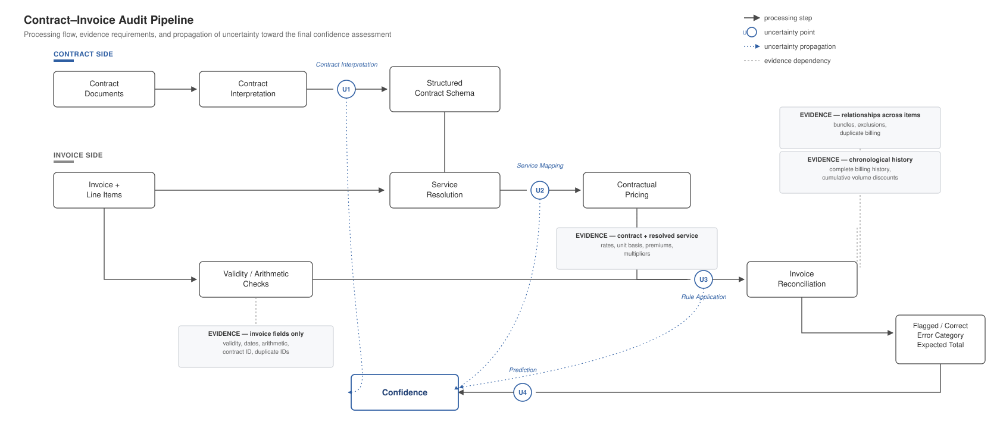
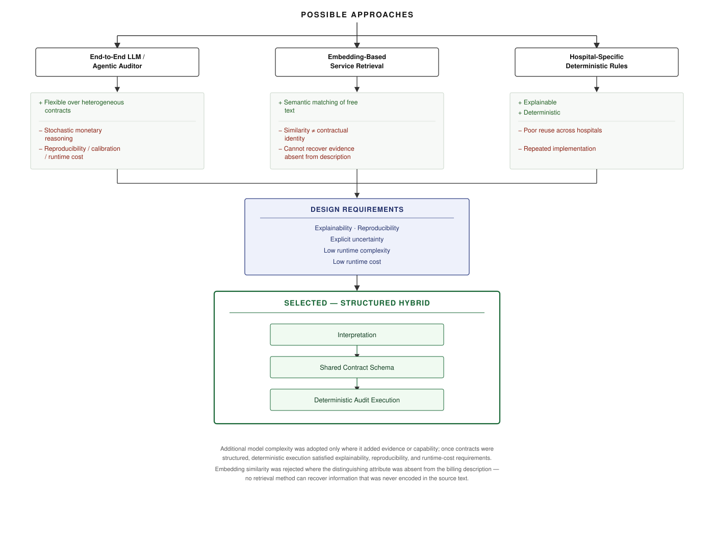

# Insurance Invoice Auditing

A deterministic invoice-auditing pipeline for Meridian Health Assurance
Group. The implementation interprets hospital contract terms into
explicit structured rules, maps free-text invoice services to those
rules, applies contractual pricing and validity checks, reconciles
invoice-level findings, and produces the required submission output.

## Scope and Prioritization

The assessment allows a limited 6--8 hour implementation window and
explicitly favors strong coverage of fewer hospitals over thin coverage
of all hospitals.

-   **Hospital 1 (H1):** development and evaluation set because labels
    are provided.
-   **Hospitals 4 and 5 (H4/H5):** selected for the scored submission
    after validating contract-rule extraction and service-matching
    coverage.
-   **Hospitals 2 and 3 (H2/H3):** intentionally deferred under the time
    constraint.

The final scored submission therefore contains H4 and H5 only.

## Approach

The implementation follows an **interpret → structure → execute**
architecture.

Contract interpretation is separated from runtime auditing. Contract
terms are represented as explicit structured rules, while invoice
auditing is performed deterministically in Python. The runtime pipeline
does not call an LLM or external AI API.



The main stages are:

1.  Parse contract terms into structured rules.
2.  Run invoice and line-item validity checks.
3.  Resolve free-text service descriptions against canonical contract
    services.
4.  Apply deterministic contractual pricing rules.
5.  Reconcile findings and expected invoice totals.
6.  Assign confidence based on observable uncertainty.
7.  Produce hospital-level predictions and the final submission.

## Architecture Selection

A runtime-LLM design was considered but not selected. Using an LLM
directly during invoice auditing would make reproducibility,
calibration, and debugging harder. Instead, AI assistance was used
during development and interpretation, while the submitted execution
path remains explicit and deterministic.



This separation also makes uncertain interpretation visible: weak
service matches and unsupported mappings can remain unresolved rather
than being silently converted into contractual facts.

## Service Resolution

Invoice descriptions are free text, while contracts define canonical
service names. `service_matcher.py` resolves these using deterministic
lexical evidence.

The matcher:

-   normalizes descriptions before comparison;
-   uses conservative similarity and margin thresholds;
-   supports explicit semantic aliases where required;
-   does **not** use billed price as matching evidence;
-   may use billed unit basis as a secondary tie-break when exactly one
    plausible candidate is compatible;
-   preserves ambiguous or unresolved matches instead of forcing a
    service assignment.

The final matcher thresholds are `MIN_SCORE = 0.60` and
`MIN_MARGIN = 0.08`.

## Pricing and Contract Rules

`pricing_engine.py` applies structured contractual rules using `Decimal`
arithmetic and half-up cent rounding.

Supported rule families include:

-   base service rates and unit bases;
-   threshold premiums;
-   non-business-day uplifts;
-   cumulative volume discounts;
-   daily caps;
-   bundled-service rates;
-   exclusion windows;
-   facility multipliers;
-   plan-tier multipliers;
-   contract-term validation.

Hospital-specific ordering and rounding behavior is encoded explicitly
rather than inferred from billed totals.

## Development, Regression, and Transfer

Hospital 1 was used as the labeled development set. Errors were
investigated by failure type rather than by hard-coding individual
invoices. Changes were then protected with regression tests before
transfer to H4/H5.


Two reconciliation cases required particular care:

-   **Duplicate invoice IDs:** physical records retain separate
    identity; the latest invoice-date record is used as the canonical
    submitted record. Historical physical lines remain available where
    cumulative pricing may depend on them.
-   **Cross-invoice duplicates:** monetary remediation is applied only
    when the offending duplicate occurrence can be identified
    unambiguously. Ambiguous cases may still be flagged without
    inventing an expected-total adjustment.

These behaviors are documented assumptions informed by H1 development
evidence and are not presented as universally established contract
rules.

## Hospital Prioritization

  Hospital   Role                             Final status
  ---------- -------------------------------- --------------
  H1         Labeled development/evaluation   Implemented
  H2         Unlabeled scored hospital        Deferred
  H3         Unlabeled scored hospital        Deferred
  H4         Unlabeled scored hospital        Submitted
  H5         Unlabeled scored hospital        Submitted

H4 and H5 were selected after checking contract parse completeness,
supported rule families, and service-resolution coverage.

## H1 Development Results

The final reproducible H1 run covers **913 unique invoices**, including
**58 labeled erroneous invoices**.

  Metric                                Result
  ---------------------------- ---------------
  Flag precision                         1.000
  Flag recall                            1.000
  Mean category Jaccard                  0.746
  Exact category-set match               0.603
  Expected-total exact match             0.897
  Expected-total MAE             6,316.6 cents

Binary error detection is strong on the H1 development set, while the
main remaining weakness is diagnostic specificity: some specific
pricing-rule failures are detected through a more generic pricing
category.

These are **development-set results**, not held-out estimates of H4/H5
accuracy.

## Submitted Coverage

The final `outputs/submission.csv` contains H4 and H5 only.

  Hospital           Rows   Flagged
  ----------- ----------- ---------
  H4                  835        63
  H5                1,050        76
  **Total**     **1,885**   **139**

No labels are provided for H4/H5, so these counts are coverage and
prediction summaries rather than accuracy measurements.

## Repository Structure

``` text
insurance_auditing/
├── README.md
├── requirements.txt
├── data/
├── outputs/
│   ├── submission.csv
│   ├── submission_H1.csv
│   └── evaluation_report_h1.md
├── prompts/
│   └── prompt_log.md
├── readme_assets/
│   ├── audit_pipeline_diagram.svg
│   ├── architecture_tradeoff.svg
│   └── workflow_diagram_v2.svg
└── src/
    ├── run_pipeline.py
    ├── contract_parser.py
    ├── validity_checks.py
    ├── service_matcher.py
    ├── pricing_engine.py
    ├── evaluate.py
    ├── test_pricing_engine.py
    └── test_pipeline.py
```

## Reproduction

From the repository root:

``` bash
pip install -r requirements.txt
python src/run_pipeline.py
```

The pipeline:

1.  generates H1 development predictions;
2.  generates H4 and H5 predictions;
3.  combines H4/H5 into `outputs/submission.csv`;
4.  evaluates H1 against the supplied labels;
5.  runs the pricing regression suite.

The complete discovered test suite can also be run with:

``` bash
python -m unittest discover -s src -p "test_*.py" -v
```

The final local validation passed **43/43 tests**. The full pipeline
reproduced the H1 metrics above and generated exactly **1,885 H4/H5
submission rows**.

## Key Modules

-   `run_pipeline.py` --- end-to-end orchestration and submission
    generation.
-   `contract_parser.py` --- extraction of supported contract rule
    families.
-   `validity_checks.py` --- invoice/line-item structural and validity
    checks.
-   `service_matcher.py` --- conservative free-text service resolution.
-   `pricing_engine.py` --- deterministic contractual pricing and
    violation detection.
-   `evaluate.py` --- H1 development metrics and confidence calibration.
-   `test_pricing_engine.py` --- pricing and contract-rule regression
    tests.
-   `test_pipeline.py` --- submission-level duplicate reconciliation
    regression tests.

## Known Limitations

-   H2 and H3 are outside the submitted scope.
-   H1 labels were used for development, so H1 metrics should not be
    interpreted as held-out performance.
-   Duplicate-ID canonicalization uses the latest invoice date, an
    H1-informed assumption transferred to H4/H5.
-   Some cumulative pricing behavior can be uncertain when duplicate
    physical records interact with historical thresholds.
-   Free-text service resolution is intentionally conservative;
    unresolved mappings reduce confidence rather than being forced.
-   Category attribution remains less accurate than binary error
    detection, particularly when a specific premium, discount, or bundle
    failure can also appear as a generic unit-price mismatch.
-   No labeled H4/H5 outcomes are available to measure final submission
    accuracy.

## If Additional Time Were Available

Further work would prioritize H2/H3 contract support, broader regression
coverage for cumulative-history edge cases, improved attribution of
specific pricing-rule failures, and validation of duplicate-record
assumptions on additional labeled data.

## AI Use Disclosure

AI tools were used as development and documentation aids, with different
models used for distinct stages:

-   **Claude Sonnet 5** --- initial problem framing, assessment
    interpretation, scope prioritization, and development planning.
-   **Claude Opus 5** --- code generation and implementation assistance
    during development.
-   **ChatGPT (GPT-5.6 Sol)** --- post-implementation technical review,
    technical write-up and documentation, consolidation of the
    development prompt history into the prompt log, and final
    formatting.

The submitted auditing pipeline itself is deterministic Python. No
external LLM or AI API is called during pipeline execution or required
to reproduce the submitted results.
